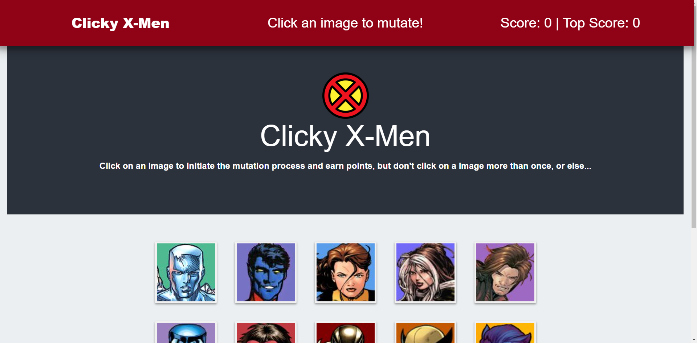
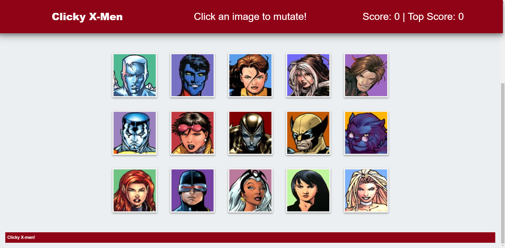

# Clicky X-Men  [](https://opensource.org/licenses/MIT) 
###### This readme has been procedurally generated 

-----------------------
## Table of Contents
1. [Description](#description)
2. [Deployed link](#deployed-link)
3. [Installation](#installation)
4. [Usage](#usage)
5. [Code snippets](#code-snippets)
6. [Licenses](#licenses)
7. [Contributing](#contributing)
8. [Tests](#tests)
9. [Questions](#questions)

-----------------------
## Description
Apocalypse is coming! How well do you know your fellow mutants. Click on each image once and only once or else Apocalypse will win. The images mutate as you progress, randomizing their position to keep you on your toes.

How many mutants do you know? 



-----------------------
## Deployed link
https://akhalid88.github.io/clicky-x-men/

-----------------------
## Installation
To install dependencies run the following command:
```
npm install
```

-----------------------
## Usage
To use this repo you will need a working knowledge of React.JS . 

To run this tool use the following command in the project directory: 

```
npm start
```
Runs the app in the development mode.\
Open [http://localhost:3000](http://localhost:3000) to view it in the browser.


-----------------------
## Code snippets
The core aspect of React.JS is the *Component*. You can build out multiple *Components* and call them in your *render()* function. Every Component can only return a single root element. This informs how we code out a web page. In the code below, <**Wrapper**> contains all the other Components that we call such as **Navbar**, **Jumbotron**, **Card**, and **Footer**.

Anytime props (React version of parameters) are sent, a unique key identifier needs to be also sent along with them to help React identify the individual **Components**. For the Navbar, we sent `key={this.currentScore}` and for the Cards, we sent `key={mutant.id}` as the unique identifier.

```javascript
render() {
	return (
		<Wrapper>
			<Navbar
				key={this.currentScore}
				currentScore={this.state.currentScore}
				topScore={this.state.topScore}
				guess={this.state.guess}
			/>
			<Jumbotron />
			<div className="container">
				{this.state.xmen.map(mutant => (
					<Card
						selectCard={this.selectCard}
						id={mutant.id}
						key={mutant.id}
						name={mutant.name}
						image={mutant.image}
						animate={this.state.animate}
					/>
				))}
			</div>
			<Footer />
		</Wrapper>
	);
}
```

Upon the user selecting a card, we check to see if the id of the card selected matches any of the cards previously selected in the `selectedCards` array. If the id is in the array it will return a value greater than -1 and we then reset the state of the game to the starting defaults and provide some user feedback in a game over message and a css animation.

Id the index of the id returns a -1, that means that card has not been selected yet and we continue on with updating the game state by increasing the score, providing the feedback in a message and in the case that the player lost on the last round, reset the animate key to blank.


```javascript
if (this.state.selectedCards.indexOf(id) > -1) {
	// reset selectedCards and score
	this.setState({
		selectedCards: [],
		currentScore: 0,
		animate: "animate__wobble",
		guess: "Game Over: You have failed miserably!"
	});
} else {
	//increase current score by 1
	this.setState({
		currentScore: this.state.currentScore + 1,
		guess: "+1 Your x-gene is strong!",
		animate: ''
	})
```


-----------------------
## Licenses
This project uses a [MIT License](https://opensource.org/licenses/MIT). 

-----------------------
## Contributing
If you would like to contribute, you will need to know React.JS Javascript.

-----------------------
## Built With

- React.JS
- Bootstrap

-----------------------
## Questions
Created by Muhammad A Khalid

If you have any questions you can reach me at the following email: [akhalid.code@gmail.com](mailto:akhalid.code@gmail.com)

Follow my other work at GitHub: https://github.com/akhalid88/
